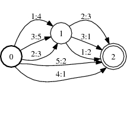
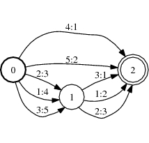

## Kaldi에 관한 처리를 일본어 문서로 정리해 보았다(데이터 준비편) 2
데이터 준비편 후편
11 : OpenFst를 사용하여 sil에서 가중 상태 변환기를 생성합니다.
가중 상태 변환기에 대해 가볍게 설명

가중 상태 변환기는 음성 인식, 기계 학습, 문자 인식 등 널리 사용되고 있다. Kaldi도 사용하고 있습니다.

세부 정보
http://www.openfst.org/twiki/bin/view/FST/FstQuickTour

아래와 같이 입력과 출력의 쌍이 있고, 그 쌍에 대해 가중치가 붙어 있고, 초기 상태로부터의 변천을 나타낸다.

상징적 인 fst.jpg

이번 경우에는

입력이 음소
출력이 단어

다음 명령으로 작성됩니다.
```bash
#silのみ出力
utils/make_lexicon_fst_silprob.pl $tmpdir/lexiconp_silprob_disambig.txt $s    rcdir/silprob.txt $silphone '#'$ndisambig | \

#置き換え処理                               
sed 's=\#[0-9][0-9]*=<eps>=g' | \for indirect one, use twice the learning rate

#音素を入力、単語を出力として重み付き状態変換器の作成                                      
fstcompile --isymbols=$dir/phones.txt --osymbols=$dir/words.txt \      
--keep_isymbols=false --keep_osymbols=false |   \ 

#１４：重み付き状態変換器をソート：下記に例を示す                     
fstarcsort --sort_type=olabel > $dir/L.fst || exit 1
```
정렬의 예

정렬 후


정렬 전과 정렬 후 출력 라벨의 오름차순으로 나란히 있음을 알 수 있습니다.
위의 그림에서는 가중치가 표시되지 않습니다.

위의 명령으로 출력 된 FST 파일의 내용을 확인하는 방법
```bash
fstprint --isymbols=./data/lang/phones.txt（音素ファイル） --osymbols=./data/lang/words.txt（単語ファイル） ../../../test_japanese/data/lang_test_tg/L.fst（fstファイル） test.txt（出力されるファイル
```
출력된 파일의 내용

|라벨|다음으로 전환할 라벨|음소|단어|웨이트|
|--|-------------------|--|--|--|
|0	|1	|		| |0.693147182|
|0	|1	|SIL	|0.693147182|
|1	|1	|SIL	|!SIL||	
|1	|1	|SIL_E	|'EM	|0.693147182|
|1	|2	|SIL_E	|'EM	|0.693147182|
|1	|1	|SIL_B	|A	|0.693147182|
|1	|2  |SIL_B	|A	|0.693147182|
|1	|	|		| |
|2	|1	|SIL| | |	

이것들을 그림으로 고치고 싶다면
shell-session
fstdraw --isymbols=./data/lang/phones.txt（音素ファイル） --osymbols=./data/lang/words.txt（単語ファイル） ../../../test_japanese/data/lang_test_tg/L.fst(fstファイル) test.dot（dot記述式ファイル）

dot 파일을 이미지 파일로 변환하고 엽니다.
```bash
dot -Tjpg test.dot > test.jpg
xli test.jpg
```
아래와 같이 출력되는


표에 나타낸 라벨, 다음으로 천이하는 라벨, 음소, 단어, 가중치에 대응하는 것을 알 수 있다.

12 : utils / sym2int.pl을 사용하여 다음 파일을 int 형식으로 변환합니다.
oov.txt
phones.txt
roots.txt
word_boundary.txt

13 : disambiguation symbols의 fst 파일을 작성한다.
14: 출력된 디렉토리를 체크한다.
언어 모델에 대해 가중 상태 변환기를 생성합니다.
```bash
cat $lmdir/lm.arpa | \                                                                 
grep -v '<s> <s>' | \                                                                
grep -v '</s> <s>' | \                                                               
grep -v '</s> </s>' | \                                                              
arpa2fst - | fstprint | \                                                            
utils/remove_oovs.pl $tmpdir/oovs.txt | \                                            
utils/eps2disambig.pl | utils/s2eps.pl | fstcompile --isymbols=$test/words.txt \     
--osymbols=$test/words.txt  --keep_isymbols=false --keep_osymbols=false | \        
fstrmepsilon | fstarcsort --sort_type=ilabel > $test/G.fst                           

fstisstochastic $test/G.fst
```
빈 문자에 대해서도 fst 파일 만들기
```bash
awk '{if(NF==1){ printf("0 0 %s %s\n", $1,$1); }} END{print "0 0 #0 #0"; print "0";}' \
   < "$lexicon"  >$tmpdir/g/select_empty.fst.txt                               

 fstcompile --isymbols=$test/words.txt --osymbols=$test/words.txt \                     
  $tmpdir/g/select_empty.fst.txt | \

 fstarcsort --sort_type=olabel | fstcompose - $test/G.fst > $tmpdir/g/empty_words.fst   

 fstinfo $tmpdir/g/empty_words.fst | grep cyclic | grep -w 'y' &&                       
 echo "Language model has cycles with empty words" && exit 1                          

 rm -rf $tmpdir
 ```
이것으로 데이터 준비가 종료됩니다.
다음부터는 데이터로부터의 특징량 추출에 들어갑니다.
